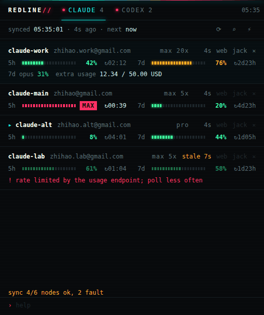

# REDLINE//

> 管理多个 **Claude Code** / **Codex** 账号：同时查看所有账号的额度，自动找到电脑上已有的登录，一键把所有账号登录上线，并且每个账号的网页都在它自己绑定的 Chrome（Google 账号）里打开。

<p align="center"></p>

- **托盘常驻**：程序待在 Windows 任务栏的“显示隐藏的图标”里。图标的圆环表示所有账号中最高的 5h 用量，点开是一个极简的赛博风控制台。
- **Claude 和 Codex 分开放**：顶部有两个标签 `CLAUDE·4` 和 `CODEX·2`（Alt+1 / Alt+2 切换），每页只显示一种账号，一行一个，显示 5h 和 7d 额度、重置倒计时 `↻02:13`，以及数据几秒前更新。
- **用完就是用完**：额度到 100% 时整条进度条变成纯红，数字显示为 `MAX`，不闪烁，也不会留下一格让人误以为还有额度。进度条按实际用量向下取整，显示的只会比实际多用，不会少。
- **自动发现**：`⌕` 或 `scan` 会找出电脑上所有 Claude 和 Codex 的登录。
- **一键登录**：`⚡` 或 `wake` 作用于当前标签页的所有账号。过期 token 自动刷新；需要登录的账号逐个登录，浏览器在该账号绑定的 Chrome profile 里打开。
- **删掉不要的账号**：鼠标移到一行上，点 `✕`，再点一次 `remove?` 确认。删除只是从 redline 里移除，登录文件保留在磁盘上，`scan` 也不会把它加回来。`restore <name>` 可以撤销，`scan all` 可以把删掉的都找回来。
- **自动更新**：exe 会自己检查 GitHub Releases，有新版本就下载、校验 SHA-256、替换自身并重启，不用再手动下载。
- 核心监控功能零依赖（纯 Python 3.11+ 标准库），支持 Windows、macOS 和 Linux。

## 安装

**Windows（不需要 Python）**：从 [Releases](https://github.com/tsljgj/agent-management/releases/latest) 下载 `redline.exe`，放到一个固定的位置，比如 `%LOCALAPPDATA%\redline\`，然后双击运行。第一次启动会自动 `scan` 一遍。之后的版本会**自动更新**，更新时会弹出通知。

> 自动更新的原理：CI 每次在 `main` 或 `claude/*` 分支上构建通过，就发布一个 `build-<N>` release，附带 `redline.exe` 和 `.sha256` 文件。exe 在启动后约 45 秒检查一次，之后每 6 小时检查一次。发现新版本后，先下载并校验 SHA-256，再把自己改名为 `redline.exe.old`（Windows 允许给正在运行的 exe 改名），把新文件放到原位置并启动它，最后旧进程退出。托盘菜单里可以关掉 **Auto-update**，也可以点 **Check for updates** 手动检查，控制台里对应的命令是 `update`。注意 exe 不要放在 `Program Files` 这种需要管理员权限才能写入的目录。

**从源码安装**：

```bash
pip install -e ".[tray]"     # 不需要托盘的话，pip install -e . 就够了
redline tray                 # 托盘和控制台（Windows 上用 pythonw -m redline tray 可以不弹出黑窗口）
.\scripts\build_windows.ps1   # 自己打包 dist\redline.exe
```

## 快速上手

```bash
redline scan          # 找出电脑上已有的 Claude / Codex 登录并登记（--dry-run 只看不登记）
redline profiles      # 列出 Chrome / Edge / Brave 的 profile 和各自登录的 Google 邮箱
redline wake          # 所有账号上线：刷新过期 token，其余的逐个登录
redline usage         # 在终端里看所有账号的额度
```

账号和 Chrome profile 的对应关系**默认按邮箱自动匹配**：Claude 或 ChatGPT 账号的邮箱等于某个 profile 登录的 Google 邮箱，就算匹配上。对不上时可以手动绑定：

```bash
redline bind claude-work work@gmail.com     # 按 Google 邮箱绑定
redline bind claude-alt "Profile 3"         # 或者按 profile 目录名或显示名
redline bind claude-alt none                # 取消绑定，恢复自动匹配
redline web claude-work                     # 在该 profile 里打开 claude.ai
```

## 控制台

```
REDLINE//   ● CLAUDE 4   ● CODEX 2                                05:34
synced 05:34:34 · 3s ago · next 01:48                        ⟳  ⌕  ⚡
claude-work  zhihao.work@gmail.com          max 20x   3s   web jack ✕
5h ▮▮▮▮▮▮▮▮▯▯▯▯▯▯▯▯▯▯▯▯  42%  ↻02:12    7d ▮▮▮▮▮▮▮▮▮▮▮▮▮▮▮▯▯▯▯▯  76%  ↻2d23h
claude-main  zhihao@gmail.com                max 5x   3s   web jack ✕
5h ▮▮▮▮▮▮▮▮▮▮▮▮▮▮▮▮▮▮▮▮  MAX  ↻00:39    7d ▮▮▮▮▯▯▯▯▯▯▯▯▯▯▯▯▯▯▯▯  20%  ↻4d23h
› _
```

- 标签页前的小圆点表示这一页的最坏状态：绿、黄、红分别对应用量 <70%、70–90%、≥90%，有账号出错时也是红色。
- `▸` 标出当前页 5h 剩余额度最多的账号。
- 每行末尾的 `web` / `jack` / `✕` 平时是暗的，鼠标移上去才亮。
  - `web`：在该账号的 Chrome profile 里打开网页。
  - `jack`：开一个以该账号运行的终端。
  - `✕`：删除，需要点两次确认。
- 日志平时只显示最后一行，点它或者输入命令会展开，按 Esc 收起。再按一次 Esc 把窗口收回托盘。

```
claude | codex                切换标签页（Alt+1 / Alt+2）
scan [all] / wake [names|cancel] / login <name> / web <name> / jack <name>
rm <name..> -y / removed / restore <name>
best / add <claude|codex> <name> / profiles / bind <name> <email> / update / rain / clear / hide
```

托盘右键菜单包括：

- Web ▸ 和 Jack in ▸：按账号选择
- Refresh now
- Scan for accounts
- Wake all
- Auto-refresh expired tokens：开关
- Check for updates
- Auto-update：开关
- Start with Windows：开机自启
- Quit

用量越过 80% 或 95% 时会弹出 Windows 通知。

## 一键登录是怎么做的

1. **Token 过期，但有 refresh token**：直接刷新并写回凭据文件，不需要浏览器。刷新前会先拿到和 Claude Code 自己一样的锁（`<配置目录>.lock`），拿到锁后重新读一次文件。如果 CLI 刚好已经刷新过，就不再重复刷新，避免 refresh token 轮换导致 CLI 被登出。
2. **没有登录**：在后台运行 `claude auth login --claudeai --email <profile 的邮箱>`（Codex 运行 `codex login`），同时设置 `BROWSER=redline`。CLI 要打开浏览器时会调用 redline，redline 再用 `chrome --profile-directory=<该账号的 profile>` 打开授权页。授权完成后回调到 localhost，**不需要复制粘贴任何东西**。
3. 等到凭据文件出现新的 token，再去读登上的邮箱。如果和另一个账号重复，或者和绑定 profile 的邮箱不一致，就报警。然后继续登录下一个账号。

> 旧版 Claude Code 没有 `claude auth login`，会退回为打开一个终端执行 `/login`。Codex 在 Windows 和 macOS 上不认 `BROWSER`，所以 redline 会读取它打印的授权链接，在正确的 profile 里打开。但 Codex 自己也会在默认浏览器里再开一个标签页，关掉那个就行。

## 原理

| Provider | 目录环境变量 | 凭据 | 用量接口 |
|---|---|---|---|
| Claude | `CLAUDE_CONFIG_DIR` | `.credentials.json`（macOS 在 Keychain `Claude Code-credentials-<hash>`） | `GET https://api.anthropic.com/api/oauth/usage` |
| Codex | `CODEX_HOME` | `auth.json` | `GET https://chatgpt.com/backend-api/wham/usage` |

这两个接口就是 `claude` 的 `/usage` 和 `codex` 的 `/status` 背后调用的接口，返回的百分比和官方显示的一致。

## 其它命令

```bash
redline usage [names] [--json]     # 终端表格或 JSON
redline watch -n 120               # 每 2 分钟刷新一次
redline serve                      # 在浏览器里打开同一个控制台 http://127.0.0.1:8765
redline add claude work / redline rm exp1 exp2 / redline restore exp1
redline run work -- --resume       # 以 work 账号运行 claude
eval "$(redline env work)"         # 在当前 shell 切换到 work 账号
```

## 注意

- 控制台只监听 `127.0.0.1`。每次启动会生成随机 token，并校验 Host 头，所以其他网页无法借本地端口去开终端或浏览器。
- Claude 用量接口的限流比较严格，默认每 120 秒同步一次（`-n` 可调），手动刷新至少间隔 15 秒。被限流时继续显示旧数据。
- 托盘和 `serve` 默认开启 auto-refresh，也就是自动刷新过期 token，可以在托盘菜单里关掉。`redline usage` 默认只读，需要刷新时加 `--refresh-tokens`。
- 存在 macOS Keychain 里的 Claude 凭据不会被改写，需要在该账号下运行一次 `claude` 让它自己刷新。
- 如果 Codex 配置了 `cli_auth_credentials_store = "keyring"`，本工具目前读不到它的 token。
- 旧版 Windows 10 上控制台窗口打不开的话，需要安装 [WebView2 Runtime](https://developer.microsoft.com/microsoft-edge/webview2/)。exe 没有代码签名，SmartScreen 可能会拦截，点“仍要运行”即可。
- 配置保存在 `~/.redline/config.json`（可以用 `REDLINE_HOME` 修改）。旧的 `~/.agentman` 会被自动沿用。

## 类似项目调研（2026-09）

| 项目 | 形态 | 多账号 | Claude | Codex | 说明 |
|---|---|---|---|---|---|
| [steipete/CodexBar](https://github.com/steipete/CodexBar) | macOS 菜单栏 | ✓（token accounts） | ✓ | ✓ | 最成熟，支持几十个 provider，**仅限 macOS** |
| [f-is-h/Usage4Claude](https://github.com/f-is-h/usage4claude) | macOS 菜单栏 | ✓ | ✓ | ✓ | 支持多个 Claude 账号和组织，也支持 Codex |
| [crandrosoff/clauth](https://github.com/crandrosoff/clauth) | CLI / TUI / MCP | ✓ | ✓ | ✗ | 切换 Claude 账号，快到上限时自动切换，**只支持 Claude** |
| [CodeZeno/Claude-Code-Usage-Monitor](https://github.com/CodeZeno/Claude-Code-Usage-Monitor) | Windows 任务栏 | ✓ | ✓ | ✓ | **仅限 Windows** |
| [jens-duttke/usage-monitor-for-claude](https://github.com/jens-duttke/usage-monitor-for-claude) | Windows 托盘 | 每个账号开一个进程 | ✓ | ✗ | |
| [Maciek-roboblog/Claude-Code-Usage-Monitor](https://github.com/Maciek-roboblog/Claude-Code-Usage-Monitor) | 终端 | ✗ | ✓ | ✗ | 通过本地 jsonl 日志估算 token，**不是**官方百分比 |

本项目的定位：**跨平台（包括 Linux 和远程服务器）的 CLI + Web**，同时支持 Claude 和 Codex 的多账号。可以用 JSON 接入其他工具，也可以跑在一台服务器上集中看所有账号。

## 开发

```bash
pip install pytest && python -m pytest -q
```

## Roadmap

- [x] 快到上限时提醒（Windows 通知）
- [ ] 提醒推送到 webhook / Telegram
- [ ] 记录用量历史并画趋势图（SQLite）
- [ ] 自动推荐或切换到剩余额度最多的账号（`redline pick claude`）
- [ ] 支持 Cursor / Gemini CLI / Copilot 等更多 provider
